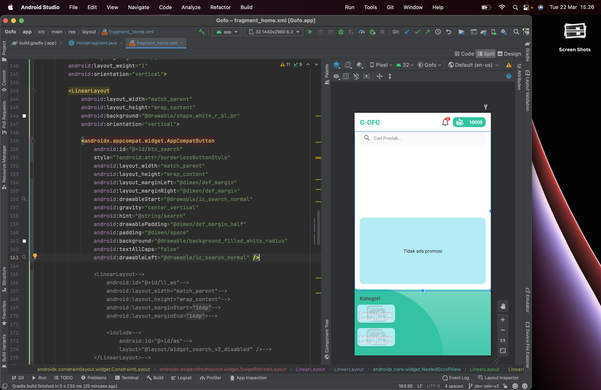

# MyReminder
 Remider Confused Program

#### `style.xml`
```xml
//type 1
<item name="android:statusBarColor" tools:targetApi="l">@android:color/white</item>
<item name="android:fitsSystemWindows">false</item>

//type 2
<item name="android:navigationBarColor">@color/black</item>
<item name="android:windowLightNavigationBar" tools:targetApi="27">true</item>
```
```java
int decore = -1;
//type 1
if (Build.VERSION.SDK_INT >= Build.VERSION_CODES.M) {
    //enable this tho maker icon status bar become black
    decore += View.SYSTEM_UI_FLAG_LIGHT_STATUS_BAR;
}

//type 2
if (Build.VERSION.SDK_INT >= Build.VERSION_CODES.O) {
    //enable this tho maker icon Navigation bar become black
    decore +=  View.SYSTEM_UI_FLAG_LIGHT_NAVIGATION_BAR;
}

getWindow().getDecorView().setSystemUiVisibility(decore);
```
#
#### View Height
```java
LinearLayout content = findViewById(R.id.content);
LinearLayout.LayoutParams layoutParams;
//Width Height
layoutParams = new LinearLayout.LayoutParams(
        ViewGroup.LayoutParams.MATCH_PARENT,
        GblFunction.getValueInDP(getApplicationContext(), 100)
);
```
[GblFunction.java](https://github.com/gzeinnumer/ImmersiveBestConfig/blob/master/README.md#gblfunction)
#
#### Set View Padding
```java
LinearLayout parent = findViewById(R.id.parent);
parent.setPadding(0, 0, 0, 0);
```
#
#### Height actionBarSize
```xml
android:layout_marginTop="?attr/actionBarSize"
```
#
#### Height BottomNavigation
```xml
android:layout_height="@android:dimen/navigation_bar_height"
```
#
#### Animation Default
```xml
@android:anim/bounce_interpolator
```
#
#### Remove WORD
```java
String str = "Select * FROM table1 WHERaE 1";
String strTemp = str.toUpperCase();
String toRemove = "WHERE";
int x = strTemp.indexOf(toRemove);
if (x != -1) str = str.substring(0,x) + str.substring(x+toRemove.length(),str.length());
Log.d(TAG, "onCreate_: " + str);
```
#
#### `GblVariable.myDB`
```java
public class GblVariabel {
    private static final String TAG = "GblVariabel";

    public static SQLiteDatabase myDb = null;

    public static void initDb(Context context) {
        DatabaseHelperOLD dbHelper = null;
        try {
            dbHelper = new DatabaseHelperOLD(context);k
            if (dbHelper.checkDatabase()) {
                GblVariabel.myDb = dbHelper.openDataBase();
            } else {
                Log.e(TAG, "initDb:  database kosong");
            }
        } catch (Throwable throwable) {
            throwable.printStackTrace();
            Log.e(TAG, "initDb: " + throwable.getMessage());
        }
    }
}
```
[DatabaseHelper](https://github.com/gzeinnumer/MyReminder/blob/master/files/DatabaseHelper.java)
& [DatabaseHelper Old Style](https://github.com/gzeinnumer/MyReminder/blob/master/files/DatabaseHelperOLD.java)
#
#### External android 10 Spesial Permit
```xml
<application
    android:requestLegacyExternalStorage="true">

</application>
```
#
#### Get Color
```java
ColorStateList color = ContextCompat.getColorStateList(this, R.color.white);
Color color = Color.parseColor("#F2F5F8");
int color = 0xFFCC5500;
```
#
#### Resource
```java
String string = getApplicationContext().getString(R.string.app_name);
int color = getResources().getColor(R.color.colorPrimary);
int color1 = ContextCompat.getColor(getApplicationContext(), R.color.colorPrimary);
```
#
#### Get Drawable
```java
final int sdk = android.os.Build.VERSION.SDK_INT;
if(sdk < android.os.Build.VERSION_CODES.JELLY_BEAN) {
    layout.setBackgroundDrawable(ContextCompat.getDrawable(context, R.drawable.ready) );
} else {
    layout.setBackground(ContextCompat.getDrawable(context, R.drawable.ready));
}
```
#
#### TextInputLayout Hint Color
```xml
<com.google.android.material.textfield.TextInputLayout
    android:textColorHint="@color/colorPrimary">

    <com.google.android.material.textfield.TextInputEditText />
</com.google.android.material.textfield.TextInputLayout>
```
#
#### TextInputLayout Password Toggle
```xml
<com.google.android.material.textfield.TextInputLayout
    app:endIconMode="password_toggle">

    <com.google.android.material.textfield.TextInputEditText/>
</com.google.android.material.textfield.TextInputLayout>
```
#
#### Timer CountDown
```java
//30 second 29 Second 28 Second ...... 1 Second
new CountDownTimer(30000, 1000) {

    public void onTick(long millisUntilFinished) {
        int progress = (int) millisUntilFinished / 1000;
    }

    public void onFinish() {
    }
}.start();
```
#
#### adjustResize & screenOrientation
```xml
<activity
    android:name=".MainActivity"
    android:screenOrientation="portrait"
    android:windowSoftInputMode="adjustResize" />
```
#
#### AS
```java
((Module_1_ComponentProvider) getApplication()).getModule_1_Component().inject(this);
```
#
#### Remove All Space
```java
String s = "CREATE TABLE             table1 (" +
        "id INTEGER            PRIMARY KEY AUTOINCREMENT, "+
        "name TEXT, " +
        "rating REAL, " +
        "descr TEXT, " +
        "flag_active INTEGER, " +
        "created_at TEXT)";

s=s.replaceAll("\\s+"," ");
String[] parts = s.split(" ");
Log.d(TAG, "onCreate_: "+parts[2]);
```
#
#### `getSupportFragmentManager()`
```java
Activity activity = MainActivity.this;
FragmentTransaction transaction = ((FragmentActivity) activity).getSupportFragmentManager().beginTransaction();

Class class = activity.getClass();
new Intent(requireContext(), class)
```
#
#### Kotlin simple get set
```kotlin
var TOKEN: String
    get() = prefs.getString(KEY_TOKEN,default)
    set(value) = prefs.edit().putString(KEY_TOKEN, value).apply()
```
#
#### Shape
```xml
<shape xmlns:android="http://schemas.android.com/apk/res/android"
    android:shape="rectangle">

    <corners android:Radius="50dp" />

    <solid android:color="@color/background" />

</shape>
```
#
#### TextView Color Default
```xml
android:textColor="@android:color/tab_indicator_text"

//or

#808080
```
#
#### Remove new
```java
public class ValidatorValue {

    @SuppressLint("StaticFieldLeak") static volatile ValidatorValue singleton = null;

    public static ValidatorValue get() {
        if (singleton == null) {
            synchronized (ValidatorValue.class) {
                if (singleton == null) {
                    if (ValidatorValue.context == null) {
                        throw new IllegalStateException("context == null");
                    }
                    singleton = new ValidatorValue(ValidatorValue.context).build();
                }
            }
        }
        return singleton;
    }

    static Context context;

    public ValidatorValue(Context context) {
        this.context = context;
    }

    public ValidatorValue build() {
        return this;
    }
}
```
```java
ValidatorValue.with(getApplicationContext()).build();
```
#
#### TimeFormat 12/24
```java
boolean isSystem24Hour = DateFormat.is24HourFormat(getApplicationContext());
int clockFormat;
if (isSystem24Hour){
    clockFormat = TimeFormat.CLOCK_24H;
} else {
    clockFormat = TimeFormat.CLOCK_12H;
}
```
#
#### Split String
```java
String currentString = "Fruit: they taste good";
String[] separated = currentString.split(":");
separated[0]; // this will contain "Fruit"
separated[1]; // this will contain " they taste good"
```
#
#### Last Dot . Checked
```java
if (holder.number.getText().length() > 0 && holder.number.getText().toString().endsWith(".")){
    holder.numberP.setError("Format salah");
    isDone = false;
    break;
}
```
#
#### RecyclerView Big Cached
```java
binding.rvData.setItemViewCacheSize(100);
```
#
#### RecyclerView Divider
```java
binding.rv.addItemDecoration(new DividerItemDecoration(this, DividerItemDecoration.VERTICAL));
```
#
#### RecyclerView Keep Value On Model And Show
```java
public class DummyAdapter extends RecyclerView.Adapter<DummyAdapter.ViewHolder> {

    ...

    @Override
    public void onBindViewHolder(ViewHolder holder, int position) {
        holder.binding.tvName.setText(items.get(position).itemcode);
        if (items.get(position).qty != null && items.get(position).qty.length() > 0){
            holder.binding.edQty.setText(items.get(position).qty);
        }else {
            holder.binding.edQty.setText("");
        }
    }

    @Override
    public void onViewRecycled(@NonNull ViewHolder holder) {
        super.onViewRecycled(holder);
        int index = holder.getAdapterPosition();
        if (index >= 0) {
            items.get(index).qty = holder.binding.edQty.getText().toString();
        }
    }
}
```
#
#### EditText Attribute
```java
holder.numberP.setSuffixText("%");
holder.numberP.setHint("Percentace");
holder.number.setFilters(new InputFilter[]{new InputFilter.LengthFilter(3)});
holder.number.setInputType(InputType.TYPE_CLASS_NUMBER);
holder.number.setKeyListener(DigitsKeyListener.getInstance("123456789"));
```
#
#### Disable 0 First
```java
//maven { url "https://jitpack.io" }
//implementation 'com.github.gzeinnumer:MyLibSimpleTextWatcher:1.0.1'

editTexts.addTextChangedListener(new SimpleTextWatcher(s -> {
    if (s.length() > 0 && s.toString().charAt(0) == '0') {
        final String newText = s.toString().substring(1);
        editTexts.setText(newText);
        editTexts.setSelection(newText.length());
    }
}));
```
#
#### Disable Space First
```java
//maven { url "https://jitpack.io" }
//implementation 'com.github.gzeinnumer:MyLibSimpleTextWatcher:1.0.1'

editTexts.addTextChangedListener(new SimpleTextWatcher(s -> {
    if (s.length() > 0 && s.toString().charAt(0) == ' ') {
        final String newText = s.toString().substring(1);
        editTexts.setText(newText);
        editTexts.setSelection(newText.length());
    } else {
        srVM.setValue(s.toString());
    }
}));
```
#
#### Intent to GMaps
```java
Uri gmmIntentUri = Uri.parse("http://maps.google.com/maps?saddr="+Olatitude+","+Olongitude+"&daddr="+Dlatitude+","+Dlongitude+"");
Intent mapIntent = new Intent(Intent.ACTION_VIEW, gmmIntentUri);
mapIntent.setPackage("com.google.android.apps.maps");
startActivity(mapIntent);
```
#
#### Read JSON From Assets
```java
//readFile(MainActivity.this, "raw/my_json.json");
public static String readFile(Activity activity, String fileName) {
    BufferedReader reader;
    StringBuilder content = new StringBuilder();
    try {
        reader = new BufferedReader(new InputStreamReader(activity.getAssets().open(fileName), "UTF-8"));
        String line;
        while ((line = reader.readLine()) != null) {
            content.append(line.trim());
        }
    } catch (IOException e) {
        e.printStackTrace();
    }
    return content.toString();
}
```
#
#### Read Image From Assets
```java
try {
    // get input stream
    InputStream ims = getAssets().open("avatar.jpg");
    // load image as Drawable
    Drawable d = Drawable.createFromStream(ims, null);
    // set image to ImageView
    mImage.setImageDrawable(d);
  ims .close();
}
catch(IOException ex)
{
    return;
}
```
#
#### setBackgroundResource programatically
```java
bindingItem.tvStatus.setText("Open");
bindingItem.tvStatus.setBackgroundResource(R.drawable.shape_green);
```
#
#### ShapeTextView
```xml
<TextView
    android:background="@drawable/shape_green"
    android:paddingStart="5dp"
    android:paddingEnd="5dp"
    android:text="Open"
    android:textColor="@android:color/white" />
```
```xml
<?xml version="1.0" encoding="utf-8"?>
<shape xmlns:android="http://schemas.android.com/apk/res/android"
    android:shape="rectangle">
    <corners android:radius="5dp" />
    <solid android:color="@color/green_500" />
</shape>
```
#
#### Copy All Record Table
```
insert into api_response
select * from buang_api_response a
where not EXISTS (select 1 from api_response b where a.id=b.id);
```
#
#### Koltin Configuration


#
#### Http Save Log
```java
HttpLoggingInterceptor logging = new HttpLoggingInterceptor(new Logger() {
  @Override public void log(String message) {
    Timber.tag("OkHttp").d(message);
  }
});
```
#
#### Set Drawable
```java
myImgView.setImageDrawable(getResources().getDrawable(R.drawable.ic_arrow_down));
myImgView.setImageDrawable(ContextCompat.getDrawable(context, R.drawable.ic_arrow_down));
```
#
#### Get Date Range
```java
Calendar mCalendar = Calendar.getInstance();
//int remainingDay = mCalendar.getActualMaximum(Calendar.DAY_OF_MONTH) - mCalendar.get(Calendar.DAY_OF_MONTH) + 1;
int remainingDay = 7;
ArrayList<String> allDays = new ArrayList<String>();
SimpleDateFormat mFormat = new SimpleDateFormat("YYYY-MM-dd");
for(int i = 0; i < remainingDay; i++){
    // Add day to list
    allDays.add(mFormat.format(mCalendar.getTime()));
    // Move pref day
    mCalendar.add(Calendar.DAY_OF_MONTH, -1);
    // Move next day
    //mCalendar.add(Calendar.DAY_OF_MONTH, 1);
}

Log.d(getClass().getSimpleName(), "on_Create: "+allDays.toString());
```
#
#### Create Random Code
```java
public int createRandomCode(int codeLength) {
    char[] chars = "1234567890".toCharArray();
    StringBuilder sb = new StringBuilder();
    Random random = new SecureRandom();
    for (int i = 0; i < codeLength; i++) {
        char c = chars[random.nextInt(chars.length)];
        sb.append(c);
    }
    return Integer.parseInt(sb.toString());
}
```
#
#### Object ToJson - Json ToObject
```java
Log.d(getClass().getSimpleName(), "onCre_ate: "+read.get(i).toJson());

public String toJson() {
    return new GsonBuilder().create().toJson(this, Table1.class);
}

//with json indent
@Override
public String toString() {
    return new GsonBuilder().setPrettyPrinting().create().toJson(this, S_Maintenace_Header.class);
}
```
```java
Gson gson = new Gson();
Log.d(getClass().getSimpleName(), "onCre_ate: "+gson.toJson(read.get(i)));
```
```java
String json = string_json;
List<Object> lstObject = gson.fromJson(json_ string, Object.class);
```
#
#### Object ToJson - Json ToObject
```java
@POST("api/save")
Flowable<Response<BaseResponseKao>> sendTraveling2(@Body Trans_H trans_h);
```
```java
String request = gson.toJson(data);
apiService.sendData(data)
    .subscribe(new Consumer<Response<BaseResponseKao>>() {
        @Override
        public void accept(Response<BaseResponseKao> response) throws Exception {
            Toast.makeText(this, "_"+response.body().getMessage(), Toast.LENGTH_SHORT).show();
            Toast.makeText(this, "_"+response.code(), Toast.LENGTH_SHORT).show();
            Toast.makeText(this, "_"+response.headers(), Toast.LENGTH_SHORT).show();
            Toast.makeText(this, "_"+response.raw().request().url(), Toast.LENGTH_SHORT).show();
            Toast.makeText(this, "_"+response.raw().request().method(), Toast.LENGTH_SHORT).show();
            Toast.makeText(this, "_"+response.raw().request().headers(), Toast.LENGTH_SHORT).show();
            Toast.makeText(this, "_"+bodyToString(response.raw().request().body()), Toast.LENGTH_SHORT).show();
        }
    }, throwable -> {

    });
```
```java
private String bodyToString(final RequestBody request) {
    try {
        final RequestBody copy = request;
        final Buffer buffer = new Buffer();
        if (copy != null)
            copy.writeTo(buffer);
        else
            return "";
        return buffer.readUtf8();
    } catch (final IOException e) {
        return "did not work";
    }
}
```
```java
//implementation 'com.squareup.retrofit2:retrofit:2.8.1'

public String requestToString(Response response) {
    String msg = "";

    msg+="\nCode : "+ response.code();
    msg+="\nMethod : "+response.raw().request().method();
    msg+="\nURL : "+response.raw().request().url();
    //msg+="\nHeaders :\n "+response.headers().toString();
    //msg+="\nToken :\n "+response.raw().request().headers();
    msg+="\nResponse :\n"+response.body().toString();
    msg+="\n\nRequest :\n "+bodyToString(response.raw().request().body());

    return msg;
}
```
#
#### CI3 CI4 CodeIgnither Laravel

- CI3
```php
$sql = "select * from users order by id desc;";
$query = $this->db->query($sql);
return $query->result_array();
//echo $d['id'];;
```

- CI4
```php
$query = "SELECT * FROM product;";
$db = \Config\Database::connect();
$data = $db->query($query);

// return json_encode($data->getResult());
// return json_encode($query->getResultArray());
// return json_encode($query->getRow());
return $this->respond($data->getResult());
```

- Laravel
```php
$data = DB::select("SELECT kilometer FROM tyres WHERE usage=1 ORDER by id DESC LIMIT 1");

Tyres::select('kilometer')->where('usage',1)->orderBy('id', 'DESC')->take(1)->get();
```
#
#### CompositeDisposable RXJava
```java

private final CompositeDisposable compositeDisposable = new CompositeDisposable();
compositeDisposable.add(
    apiService.registerDeview()..
);
```
#
#### SD_SO_MAIN 
```
search on google `leveling query id parent_id mysql`.
```
#
#### Base64 String
```
import org.apache.commons.codec.binary.Base64;

Strig str = "gzeinnumer";

// Encode data on your side using BASE64
byte[] bytesEncoded = Base64.encodeBase64(str.getBytes());
Log.d(TAG,"encoded value is " + new String(bytesEncoded));

// Decode data on other side, by processing encoded data
byte[] valueDecoded = Base64.decodeBase64(bytesEncoded);
Log.d(TAG,"Decoded value is " + new String(valueDecoded));
```

[Recomended](https://stackoverflow.com/questions/20215744/how-to-create-a-mysql-hierarchical-recursive-query)

#
#### Flutter Update
```
flutter channel master
flutter upgrade
```
#
#### CI4 Redirect
```php
return redirect()->to('url'); 
return redirect()->route('named_route');
```
#
#### Flutter Row Center
```dart
Row(
    mainAxisAlignment: MainAxisAlignment.spaceEvenly,
    children: []
)
```
#
#### Flutter List
```dart
List<T> datas = List<T>.empty(growable: true);
json['datas'].forEach((v) {
    datas.add(create(v));
});
```
#
#### Flutter Items Generator
```dart
final List<MyModel>? product_desc;

List<Widget> get items => itemGenerator(product_desc!);

List<Widget> itemGenerator(List<MyModel> data){
    List<Widget> d = List<Widget>.empty(growable: true);
    for(var i=0; i<data.length; i++){
      d.add(Text(data[i].description.toString()));
    }
    return d;
}
```
```dart
List<String> list = ['one', 'two', 'three', 'four'];
List<Widget> widgets = list.map((name) => new Text(name)).toList();
```
```dart
var list = ["one", "two", "three", "four"];

child: Column(
    mainAxisAlignment: MainAxisAlignment.center,
    children: <Widget>[
        for(var item in list ) Text(item)
    ],
),
```
```
https://stackoverflow.com/questions/50441168/iterating-through-a-list-to-render-multiple-widgets-in-flutter
```
#
#### Flutter Generate From Current Value
```dart
String get freeDeliveryString => freeDelivery(subTotal);

String freeDelivery(subTotal){
    if(subTotal >= 30){
        return "You have FREE Delivery";
    } else{
        double missing = 30.0-subTotal;
        return "Add \$${missing.toStringAsFixed(2)} for FREE Delivery";
    }
}
```
#
#### Flutter Generate Widget Array
```dart
var list = ["one", "two", "three", "four"];

@override
Widget build(BuildContext context) {
    return new MaterialApp(
        home: new Scaffold(
            appBar: new AppBar(
                title: new Text('List Test'),
            ),
            body: new Center(
                child: new Column( // Or Row or whatever :),
                children: createChildrenTexts(),
            ),
        ),
    );
}

List<Text> createChildrenTexts() {
    /// Method 1
    List<Text> childrenTexts = List<Text>();
    for (String name in list) {
        childrenTexts.add(new Text(name, style: new TextStyle(color: Colors.red),));
    }
    return childrenTexts;

    /// Method 2
    return list.map((text) => Text(text, style: TextStyle(color: Colors.blue),)).toList();
}
```
#
#### Flutter ListView.builder
```dart
Container(
  child: ListView.builder(
    shrinkWrap: true,
    itemCount: items.length,
    itemBuilder: (BuildContext context, int index){
      return Container(
        child: Text(
          items[index]['property']
        ),
      );
    },
  ),
);
```
#
#### Flutter Statusbar Color

Update Flutter 2.0 (Recommended):
```dart
AppBar(
    backwardsCompatibility: true,
    systemOverlayStyle: SystemUiOverlayStyle(statusBarColor: Colors.white),
)
```
Only Android (more flexibility):
```dart
SystemChrome.setSystemUIOverlayStyle(SystemUiOverlayStyle(
    systemNavigationBarColor: Colors.blue, // navigation bar color
    statusBarColor: Colors.pink, // status bar color
));
```
Both iOS and Android:
```dart
AppBar(
    backgroundColor: Colors.red, // status bar color
    brightness: Brightness.light, // status bar brightness
)
```
#
#### Flutter StatusBarColor NavigationColor Recomended
```dart
SystemChrome.setSystemUIOverlayStyle(SystemUiOverlayStyle(
    statusBarColor: Colors.white,
    statusBarBrightness: Brightness.dark,
    systemNavigationBarColor: Colors.white,
    systemNavigationBarIconBrightness: Brightness.dark
));
```
```dart
AppBar(
    backwardsCompatibility: true,
    systemOverlayStyle: SystemUiOverlayStyle(
        statusBarColor: Colors.white,
        statusBarBrightness: Brightness.dark,
        systemNavigationBarColor: Colors.white,
        systemNavigationBarIconBrightness: Brightness.dark,
    ),
)
```
#
#### Flutter DebugBanner
```dart
MaterialApp(
  debugShowCheckedModeBanner: false,
)
```
#
#### nestedScrollingEnabled NestedScrollView RecyclerView
```xml
<androidx.core.widget.NestedScrollView
    android:layout_width="match_parent"
    android:layout_height="wrap_content">

    <androidx.recyclerview.widget.RecyclerView
        android:id="@+id/recyclerView"
        android:layout_width="match_parent"
        android:nestedScrollingEnabled="false"
        android:layout_height="wrap_content"
        android:padding="4dp" />

</androidx.core.widget.NestedScrollView>
```
```java
recyclerView.setNestedScrollingEnabled(false);
```
#
#### Check Service Is Running
```java
private boolean isMyServiceRunning(Class<?> serviceClass) {
    ActivityManager manager = (ActivityManager) getSystemService(Context.ACTIVITY_SERVICE);
    for (ActivityManager.RunningServiceInfo service : manager.getRunningServices(Integer.MAX_VALUE)) {
        if (serviceClass.getName().equals(service.service.getClassName())) {
            return true;
        }
    }
    return false;
}

//in function
if (!isMyServiceRunning(EmployeeVisitService.class)) {
    startService(new Intent(this, EmployeeVisitService.class));
} else {
    Log.d(TAG, "service Employee sudah ada ");
}
```
#
#### FLutter Divider
```dart
const Divider(
    height: 20,
    thickness: 5,
    indent: 20,
    endIndent: 20,
)
```
#
#### Android Issue Core:1.7
```gradle
android{
    configurations.all {
        resolutionStrategy {
            force 'androidx.core:core-ktx:1.6.0'
        }
    }
}
```
#
#### Dynamic RecyclerView Scroll On Focused Ediitext
```xml
<activity
    android:name=".ui.scoring.subMenu.pertanyaan.PertanyaanActivity"
    android:screenOrientation="portrait"
    android:windowSoftInputMode="adjustResize" />
```
```java
holder.freetext.setOnFocusChangeListener((view, b) -> {
    if (b){
        InputMethodManager imm = (InputMethodManager) context.getSystemService(Context.INPUT_METHOD_SERVICE);
        imm.toggleSoftInput(InputMethodManager.SHOW_FORCED, 0);
    }
});
```
```xml
<com.google.android.material.textfield.TextInputLayout
    android:id="@+id/freetext_p"
    style="@style/MyTextInputLayoutOutlinedBoxNext"
    android:layout_width="match_parent"
    android:layout_height="wrap_content"
    android:layout_marginTop="8dp"
    android:hint="Notes"
    android:visibility="gone"
    tools:visibility="visible">

    <com.google.android.material.textfield.TextInputEditText
        android:id="@+id/freetext"
        style="@style/MyTextInputEditText"
        android:layout_width="match_parent"
        android:layout_height="wrap_content"
        android:focusableInTouchMode="true"
        android:maxLength="200" />

</com.google.android.material.textfield.TextInputLayout>
```
```java
binding.rvData.setAdapter(adapterLevel1);
binding.rvData.setHasFixedSize(true);
binding.rvData.setLayoutManager(new LinearLayoutManager(getApplicationContext()));
binding.rvData.setItemViewCacheSize(100);
```
```xml
<!--<androidx.core.widget.NestedScrollView-->
<!--    android:layout_width="match_parent"-->
<!--    android:layout_height="wrap_content">-->

    <androidx.recyclerview.widget.RecyclerView
        android:id="@+id/rv_data"
        android:layout_width="match_parent"
        android:layout_height="wrap_content"
        android:nestedScrollingEnabled="false" />
<!--</androidx.core.widget.NestedScrollView>-->
```
#
#### Flutter Dialog Disable Outside
```dart
showDialog(
  barrierDismissible: false,
  builder: ...
);
```
#
#### FLutter CallBack
```dart
final Function()? onPositivePressed;
final ValueChanged<String>? onChanged;
```
#
#### Flutter Container Radius
```dart
Container(
    width: match_parent,
    decoration : BoxDecoration(
        color: Colors.white,
        borderRadius: new BorderRadius.circular(def_margin)
    ),
    margin: const EdgeInsets.all(def_margin),
    child: PaddingAll(
        child: Column(
            children: [
                ...
            ],
        ),
    ),
),
```
#
#### Flutter Layout Weight
```dart
return Scaffold(
  appBar: EmptyAppBar(),
  body: Stack(
    children: [
      BackgroundType4(),
      Container(
        child: Column(
          children: [
            Expanded(child: Container(color: Colors.red,)),
            Expanded(child: Container(color: Colors.blue,)),
          ],
        ),
      ),
    ],
  ),
);
```
#
#### RecyclerView Grid
```java
DummyAdapter dummyAdapter = new DummyAdapter(R.layout.item_kategori, position -> {

});
binding.rvKategori.setAdapter(dummyAdapter);
GridLayoutManager layoutManager = new GridLayoutManager(this, 2, GridLayoutManager.HORIZONTAL, false);
binding.rvKategori.setLayoutManager(layoutManager);
binding.rvKategori.hasFixedSize();
```
#
#### RecyclerView Grid Style
```java
StaggeredGridLayoutManager layoutManager = new StaggeredGridLayoutManager(2, LinearLayoutManager.VERTICAL);
GridLayoutManager layoutManager = new GridLayoutManager(this, 2);
LinearLayoutManager layoutManager = new LinearLayoutManager(this);
```
#
#### Symbol
```
• = \u2022,   ● = \u25CF,   ○ = \u25CB,   ▪ = \u25AA,   ■ = \u25A0,   □ = \u25A1,   ► = \u25BA

& = &amp;

<string name="space_demo">|&#x20;|&#x2009;|&#x200A;|</string>
| SPACE | THIN SPACE | HAIR SPACE |
```
#
#### RecylcerView No Scroll Effect
```xml
<androidx.recyclerview.widget.RecyclerView
    ...
    android:overScrollMode="never"/>
```
#
#### Best Color
```xml
<color name="text_header">#FF282828</color>
<color name="text_content">#FF1C1C1C</color>
<color name="grey_text">#363636</color>
<color name="grey_light_text">#888888</color>
<color name="white_low">#F9F9F9</color>
<color name="grey_disabled">#A8A8A8</color>
<color name="disabled_grey_light">#D3D3D3</color>
<color name="divider">#DCDCDC</color>
<color name="grey_dark">#A9A9A9</color>
<color name="red_500">#F44336</color>
<color name="green_A700">#00C853</color>
<color name="blue_500">#2196F3</color>
```
#
#### Disbale EditText
```xml
<com.google.android.material.textfield.TextInputLayout
    android:id="@+id/ed_provinsi_p"
    style="@style/MyAutoCompleteTextViewOutlineBox.Man"
    android:layout_width="match_parent"
    android:layout_height="wrap_content"
    android:hint="Provinsi*">

    <AutoCompleteTextView
        android:id="@+id/ed_provinsi"
        style="@style/MyAutoCompleteTextView"
        android:layout_width="match_parent"
        android:layout_height="wrap_content"
        android:editable="false" />
</com.google.android.material.textfield.TextInputLayout>
```
#
#### TextView Shape White Nice
```xml
<EditText
    android:id="@+id/ed_response"
    android:layout_width="match_parent"
    android:layout_height="wrap_content"
    android:layout_marginTop="@dimen/def_margin_half"
    android:background="@drawable/background_filled_white_radius_v2"
    android:gravity="start"
    android:hint="Tulis Disini"
    android:minLines="5"
    android:padding="@dimen/def_margin_half"
    android:text="@string/dummy_3"
    android:textAlignment="textStart"
    android:textSize="@dimen/h4" />
```
```xml
<TextView
    style="@style/MyTextContent"
    android:layout_width="match_parent"
    android:layout_marginStart="@dimen/def_margin"
    android:layout_marginLeft="@dimen/def_margin"
    android:layout_marginTop="@dimen/space_half"
    android:layout_marginEnd="@dimen/def_margin"
    android:background="@drawable/shape_tv_white"
    android:paddingLeft="@dimen/space"
    android:paddingTop="@dimen/space_half"
    android:paddingRight="@dimen/space"
    android:paddingBottom="@dimen/space_half"
    android:text="MyTextContent" />
```
#
#### Default Anim Android
```xml
app:exitAnim="@android:anim/fade_out"
```
#
#### Component Navigation
```kotlin
val action = FirstFragmentDirections.actionFirstFragmentToFirstDotFirstFragment("data")
findNavController().navigate(action)
```
#
#### Data Class
```koltin
data class ExampleModel(val id: Int, val name: String,val address: String)
```
```koltin
data class ExampleModel(val id: Int, val name: String,val address: String) {

    override fun toString(): String {
        return "$id - $name - $address"
    }
}
```
[Source](https://kotlinlang.org/docs/data-classes.html#properties-declared-in-the-class-body)

#
#### Color Opacity 13 30

- res/color/color_primary_30

```xml
<?xml version="1.0" encoding="utf-8"?>
<selector xmlns:android="http://schemas.android.com/apk/res/android">
    <item android:alpha="0.3" android:color="@color/colorPrimary" />
</selector>
```
- res/drawable/corner_rv
```xml
<?xml version="1.0" encoding="UTF-8"?>
<shape xmlns:android="http://schemas.android.com/apk/res/android">
    <solid android:color="@color/color_primary_13" />

    <padding
        android:bottom="1dp"
        android:left="1dp"
        android:right="1dp"
        android:top="1dp" />

    <corners
        android:bottomLeftRadius="@dimen/radius"
        android:bottomRightRadius="@dimen/radius"
        android:topLeftRadius="@dimen/radius"
        android:topRightRadius="@dimen/radius" />
</shape>
```
```xml
<color name="colorPrimary_13">#2128A8E0</color>
```

- activity_main.xml
```xml
<LinearLayout
    android:background="@drawable/corner_rv"
    android:padding="@dimen/def_margin"
    ...
    />
```
#
#### Dependency: androidx.core:core-ktx:1.7.0.
```java
buildFeatures{
    viewBinding = true
}
configurations.all {
    resolutionStrategy {
        force 'androidx.core:core-ktx:1.6.0'
    }
}
```
#
#### Round Up
```java
public int getPriceinpcs() {
    return (int) Math.ceil(priceinpcs);
}
```
#
#### Message Or Realease
```java
public static String msgDebugOrRelease(String debug, String realese) {
    if (BuildConfig.DEBUG) {
        return debug;
    } else {
        return realese;
    }
}
```
#
#### Dummy Count
```java
public static int getDummyCount() {
    return Integer.parseInt(MBUtilsDate.getCurrentTime("HH", Locale.getDefault())) + Integer.parseInt(MBUtilsDate.getCurrentTime("mm", Locale.getDefault()));
}
```
#
#### Theme Duplicate
```xml
<application
    ...
    tools:replace="android:theme, android:allowBackup">
```
#
#### Thumbnail YouTube YT

[Source](https://stackoverflow.com/questions/7324759/how-to-display-thumbnail-of-youtube-videos-in-android)
```java
//https://img.youtube.com/vi/JhTGDgS5enY/maxresdefault.jpg ->thumnail
//https://www.youtube.com/watch?v=q1KOj3yrFfg -> real video

Uri uri = Uri.parse(list.get(position).getYtUrl());
String chapter = uri.getQueryParameter("v");
String thumnailLink = "https://img.youtube.com/vi/"+chapter+"/maxresdefault.jpg";

Glide.with(context).load(thumnailLink).into(image);
```
```gradle
implementation 'com.github.bumptech.glide:glide:4.11.0'
annotationProcessor 'com.github.bumptech.glide:compiler:4.11.0'
```
#
#### Include
```xml
<include
    android:id="@+id/ws"
    layout="@layout/widget_search_v2" />
```
#
#### Validate Time
```java
Calendar rightNow = Calendar.getInstance();
int currentHourIn24Format = rightNow.get(Calendar.HOUR_OF_DAY);

if (currentHourIn24Format>=21 && currentHourIn24Format<=23){
    Toast.makeText(getApplicationContext(), currentHourIn24Format+" if", Toast.LENGTH_SHORT).show();
} else {
    Toast.makeText(getApplicationContext(), currentHourIn24Format+" else", Toast.LENGTH_SHORT).show();
}
```
#
#### Path To Base64
```java
public static String convertToBase64WithDataImage(String imagePath) {
    try {
        Bitmap bm = BitmapFactory.decodeFile(imagePath);
        //  bm = Bitmap.createScaledBitmap(bm, 1024, 1024, false);
        ByteArrayOutputStream baos = new ByteArrayOutputStream();
        bm.compress(Bitmap.CompressFormat.JPEG, 50, baos);
        byte[] byteArrayImage = baos.toByteArray();
        return "data:image/jpeg;base64," + Base64.encodeToString(byteArrayImage, Base64.DEFAULT);
    } catch (Exception e) {
        Log.d(TAG, "convertToBase64WithDataImage: " + e.getMessage());
        return " ";
    }
}


Strig path = "";
GblFunction.convertToBase64WithDataImage(path);
```
#
#### Nice CardView
```xml
<androidx.cardview.widget.CardView
    android:layout_width="wrap_content"
    android:layout_height="wrap_content"
    app:cardBackgroundColor="#F9F9F9"
    app:cardCornerRadius="10dp"
    app:cardElevation="0dp">

    <ImageView
        android:id="@+id/img"
        android:layout_width="200dp"
        android:layout_height="200dp"
        android:adjustViewBounds="true"
        android:maxHeight="150dp"
        android:scaleType="fitCenter"
        android:src="@drawable/ic_no_image"
        android:visibility="visible" />
</androidx.cardview.widget.CardView>
```
[ic_no_image.xml](https://github.com/gzeinnumer/MyReminder/blob/master/files/ic_no_image.xml)

#
#### TabLayout All Caps
```xml
<com.google.android.material.tabs.TabLayout
    app:tabTextAppearance="@style/TabLayoutText">

</com.google.android.material.tabs.TabLayout>
```
```xml
<style name="TabLayoutText" parent="TextAppearance.Design.Tab">
    <item name="textAllCaps">false</item>
</style>
```
#
#### Laravel Route
```php
//laravel 8
use App\Http\Controllers\UserController;
Route::get('/users', [UserController::class, 'index']);
// or
Route::get('/users', 'App\Http\Controllers\UserController@index');
```
#
#### TextView Html
```java
binding.tvContent.setText(Html.fromHtml(data.getMessage()));
```
#
#### Laravel Public
```
http://localhost/laravel_project/public

or

http://localhost/mylogin/public

php artisan serve --host 0.0.0.0

http://192.168.1.3:8000/api/login
```
#
#### BottomNavigationView label always show
```xml
<com.google.android.material.bottomnavigation.BottomNavigationView
    ...
    app:labelVisibilityMode="labeled"
    app:menu="@menu/bottom_navigation_menu_v1" />
```
#
#### SQL ORDER BY NO ID
```java
String query = "SELECT *, ROW_NUMBER() OVER() as LineNo  FROM " + table + " order by LineNo DESC;";
```
#
#### Route Laravel Prefix
```php
use App\Http\Controllers\API\PagingControllerZein;
Route::prefix('paging')->group(function () {
     Route::get('/paging', [PagingControllerZein::class, 'paging']); //127.0.0.1:8000/api/paging/paging
});
```
#
#### Laravel Key
```
php artisan key:generate
```
#
#### Ratio ConstraintLayout
```xml
android:layout_width="0dp"
app:layout_constraintWidth_default="percent"
app:layout_constraintWidth_percent=".5"
android:layout_height="0dp"
app:layout_constraintHeight_default="percent"
app:layout_constraintHeight_percent=".5"
```
#
#### Copy Text To Clipboard
```java
private void setClipboard(Context context, String text) {
    if(android.os.Build.VERSION.SDK_INT < android.os.Build.VERSION_CODES.HONEYCOMB) {
        android.text.ClipboardManager clipboard = (android.text.ClipboardManager) context.getSystemService(Context.CLIPBOARD_SERVICE);
        clipboard.setText(text);
    } else {
        android.content.ClipboardManager clipboard = (android.content.ClipboardManager) context.getSystemService(Context.CLIPBOARD_SERVICE);
        android.content.ClipData clip = android.content.ClipData.newPlainText("Copied Text", text);
        clipboard.setPrimaryClip(clip);
    }
}
```
#
#### Laravel Blade PHP Variable
```php
public function index(){
    $data = BarangModel::all();
    $sent = [
        'data' => $data,
        'find' => null
    ];
    return view('barang.index', $sent);
}
```
```html
<input name="id" @if(!empty($find)) value="{{$find->id}}" @endif>
```
#
#### Laravel Route Name
```php
Route::prefix('barang')->group(function () {
    Route::get('/', [BarangController::class, 'index'])->name('barang.index');
    Route::post('/update', [BarangController::class, 'update'])->name('barang.update');
});
```
```php
<form action="{{ route('barang.update') }}" method="POST"></form>

<form action="/update" method="POST"></form>
```
#
#### Laravel Flash Message
```php
Route::prefix('barang')->group(function () {
    Route::get('/', [BarangController::class, 'index']); // /barang
});
```
```php
public function create(Request $r){
    BarangModel::create($r->all());
    return redirect('/barang')->with('sukses','Data berhasil diinput');
}
```
```php
@if(session('sukses'))
<div class="alert alert-success" role="alert">
  {{session('sukses')}}
</div>
@endif
```
#
#### Readmu Simple With Image
```


<pre>

</pre>
```
#
#### Node JS Express JS Starter
```
mkdir project_my
npm init -y
npm install -S express ejs
npm app.js
```
```
const express = require('express')
const app = express()

app.get('/params_input', (req, res) => {
    //
})
```
#
#### Node JS Form Run Params
```
// var run = require('child_process');
// run.fork(path + '/tools/model.js', ["BarangController"]); const data = process.argv[2];

// require('shelljs').exec('node tools/templates/laravel_web/run.js', { body: req.body });
// require('shelljs').exec('node tools/templates/laravel_web/run.js');
```
#
#### Express JS Form
```
app.post('/params_input', urlencodedParser, [

], (req, res) => {
    console.log('Got body:', req.body);
})
```
```
<form action="/params_input" method="POST" novalidate>
    <div class="form-group">
        <label for="controllerName" class="form-label">controllerName</label>
        <input type="text" class="form-control" name="controllerName" id="controllerName">
    </div>
    <button type="submit" class="btn btn-primary">Submit</button>
</form>
```
#
#### SearchView Intent
```xml
<androidx.appcompat.widget.AppCompatButton
    android:id="@+id/btn_search"
    style="?android:attr/borderlessButtonStyle"
    android:layout_width="match_parent"
    android:layout_height="wrap_content"
    android:layout_marginLeft="@dimen/def_margin"
    android:layout_marginRight="@dimen/def_margin"
    android:drawableStart="@drawable/ic_search_normal"
    android:gravity="center_vertical"
    android:hint="@string/search"
    android:drawablePadding="@dimen/def_margin_half"
    android:padding="@dimen/space"
    android:background="@drawable/background_filled_white_radius"
    android:textAllCaps="false"
    android:drawableLeft="@drawable/ic_search_normal" />
```

<pre>

</pre>

#
#### Laravel Public X Api X android
```
https://stackoverflow.com/questions/30675025/access-to-laravel-5-app-locally-from-an-external-device/30675683#30675683

php artisan serve --host 0.0.0.0
http://192.168.1.101:8000
php artisan serve --host 0.0.0.0 --port 80
http://192.168.1.101
```
https://demo-laravel.gzeinnumer.com/api/product/all
http://192.168.1.10:8000/api/product/all

#
#### SwipeRefreshLayout NestedScrollView LinearLayout

```xml
<androidx.swiperefreshlayout.widget.SwipeRefreshLayout
    android:id="@+id/swipeRefreshLayout"
    style="@style/swipeRefreshLayoutV1">

    <androidx.core.widget.NestedScrollView
        android:layout_width="match_parent"
        android:layout_height="wrap_content">

        <LinearLayout style="@style/MyParentType.List"
            android:layout_height="wrap_content"
            android:layout_width="match_parent">
        </LinearLayout>
    </androidx.core.widget.NestedScrollView>
</androidx.swiperefreshlayout.widget.SwipeRefreshLayout
```

#
#### Laravel Route Group

```php
Route::group(['namespace' => 'App\Http\Controllers'], function () {
    Route::get('/', 'HomeController@index')->name('home.index');
});
```

#
#### PHP JSON To Object

```php
$rawJson = "{ post: { text: 'my text' } }";
$decodedAsArray = json_decode($rawJson, true);
$innerPost = $decodedAsArray['post'];

$post = new Post();
$post->forceFill($innerPost);
$post->save();
```

```php
$post = new Post();
foreach ($r->all() as $key => $value) {
    $post->$key = $value;
}
$post->save();
```

#
#### laravel Image Public
```html
<!-- public/uploads/myimage.jpg -->

```

#
#### Laravel Title
```html
@yield('sidebar', \View::make('defaultSidebar'))
```
#
#### Validate FileSize
```java
//return false if file size more than 20 mB
public boolean validateFileSize(String path) {
    File file = new File(path);

    long fileSizeInBytes = file.length();
    long fileSizeInKB = fileSizeInBytes / 1024;
    long fileSizeInMB = fileSizeInKB / 1024;

    return fileSizeInMB <= 20;
}
```

#
#### Laravel Auth Get Data
```php
{{ Auth::user()->id }}
```

#
#### Collection
```
Collections.sort(listFilter, new Comparator<DataItem>() {
    @Override
    public int compare(DataItem o1, DataItem o2) {
        return o1.getStrTv2().toLowerCase().compareTo(o2.getStrTv2().toLowerCase());
    }
});
```

#
#### XML Programatically
```java
TextView txt = (TextView) View.inflate(this, R.layout.simple_txt, null);
```

#
#### SearchViewDialog 2 Item
```java
new SearchViewDialog<String>(getSupportFragmentManager())
    ...
    .setContentListHeight(350)
```

#
#### SearchView Best Struct
```java
EditTextDebounce.create(binding.ws.etSearch)
    .watch(s -> {
        if (adapter!=null)
            adapter.getFilter().filter(s.toString());
    }, 1000);
```
```java
binding.btnSubmit.setOnClickListener(view -> {
    if (binding.ws.etSearch.getText().toString().length()>0){
        binding.ws.etSearch.setText("");
        onShowLoading();
        new Handler().postDelayed(() -> {
            onHideLoading();
            binding.btnSubmit.performClick();
        }, 2000);
    } else {
        onShowLoading();
        new Handler().postDelayed(() -> {
            onHideLoading();
            validasi();
        }, 2000);
    }
});
```
- [](files/EditTextDebounce.java)

#
#### TextAppearance On All
```xml
app:suffixTextAppearance="@style/suffixTextAppearance"
```
```xml
<style name="suffixTextAppearance">
    <item name="android:textSize">@dimen/h5.1</item>
</style>
```

#
#### setTextColor
```java
mTextView.setTextColor(Color.parseColor("#bdbdbd"));
```
```java
(From API >= 23)
mTextView.setTextColor(ContextCompat.getColor(context, R.color.<name_of_color>));
```
```java
(For API < 23))
mTextView.setTextColor(getResources().getColor(R.color.<name_of_color>));
```

#
#### Sql Range Time
```sql
SELECT * FROM hours WHERE "15:49" BETWEEN time_start AND time_end AND id_dev_unit='1';
```

#
#### Laravel Params Get
```php
{{ Request::segment(1) }}
{{ Request::path() }}
{{ request()->a }}
{{ app('request')->input('page') }}
{{ request()->get('date') }}
```
```js
const currentLocation = window.location + "";
const id = currentLocation.split('/');
id[5];
```

#
#### Search RecyclerView
```java
private ArrayList<String> listFilter;
//this.listFilter = new ArrayList<>(list);

@Override
public Filter getFilter() {
    return exampleFilter;
}

private final Filter exampleFilter = new Filter() {
    @Override
    protected FilterResults performFiltering(CharSequence constraint) {
        List<String> fildteredList = new ArrayList<>();
        if (constraint == null || constraint.length() == 0) {
            fildteredList.addAll(listFilter);
        } else {
            String filterPattern = constraint.toString().toLowerCase().trim();

            for (String item : listFilter) {
                if (item.toString().toLowerCase().contains(filterPattern)) {
                    fildteredList.add(item);
                }
            }
        }
        FilterResults results = new FilterResults();
        results.values = fildteredList;
        return results;
    }

    @Override
    protected void publishResults(CharSequence constraint, FilterResults results) {
        list.clear();
        list.addAll((List) results.values);
        notifyDataSetChanged();
    }
};
```

---

```
Copyright 2021 M. Fadli Zein
```